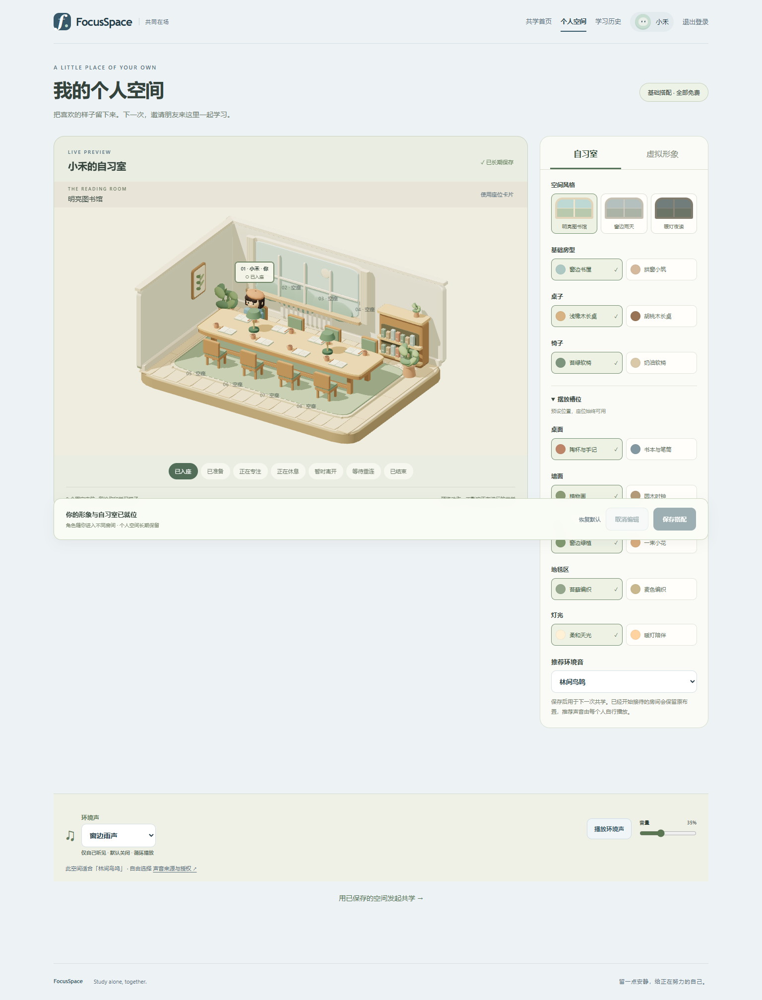

<div align="center">

# FocusSpace

**各自学习，一起专注。**

一个温暖、安静的多人在线共学空间，将专注计时、任务管理、实时陪伴与个人成长放进同一间虚拟自习室。

`React 19` · `TypeScript` · `Three.js` · `Express` · `Socket.IO` · `Prisma` · `SQLite`

</div>



## 为什么是 FocusSpace

FocusSpace 不只是一个番茄钟。你可以布置自己的 3D 自习室、带着待办进入共学房间，在同步的专注与休息节奏中感受伙伴的在线状态，并在结束后查看真实有效的学习记录。

## 核心功能

| 模块 | 能力 |
| --- | --- |
| 共学房间 | 公开或私有房间、房间码与邀请链接、最多 8 人实时在线、房主转交与异常接任 |
| 专注流程 | 可配置专注/休息时长、固定或无限轮次、断线重连、服务重启恢复、AFK 状态 |
| 任务计划 | 优先级、截止日期、标签、子任务、日程、重复规则，可将待办批量加入当前房间 |
| 沉浸空间 | Three.js 卡通低模自习室、个人角色与房间布置、三种主题、独立环境音与全屏视图 |
| 实时互动 | 成员状态、公开任务进度、轻量鼓励、休息阶段聊天、最近消息恢复 |
| 学习成长 | 有效专注结算、经验与学习币、永久装扮、成长记录与学习总结 |
| 数据洞察 | 日/周/月趋势、任务与标签分析、学习历史、周榜与等级榜 |
| 管理后台 | 用户与房间管理、内容移除、成长规则、补偿流水及审计记录 |

## 快速开始

### 环境要求

- Node.js **22.12+**
- npm
- 可写的本地磁盘；无需单独安装数据库服务

### 本地开发

```bash
npm ci
npm run setup
npm run dev
```

浏览器打开 [http://localhost:5173](http://localhost:5173)。

`setup` 会在缺少 `.env` 时复制配置模板、生成 Prisma Client、创建 SQLite 数据目录、应用迁移并构建共享包。重复执行不会清空现有配置和数据。

### 本地生产运行

```bash
npm ci
npm run setup
npm run build
npm start
```

浏览器打开 [http://localhost:3001](http://localhost:3001)。生产模式由同一个 Node.js 进程提供前端页面、HTTP API、Socket.IO 和静态资源。

> 请始终使用同一个主机名访问；`localhost` 与 `127.0.0.1` 不共享登录 Cookie。

## Windows 局域网共学

双击根目录的 `Start-FocusSpace.cmd`。启动器会识别本机 IPv4 地址、更新允许来源、安装依赖、初始化数据库、构建并启动服务。把窗口中显示的网址分享给同一 Wi-Fi 或局域网内的伙伴即可。

停止服务时双击 `Stop-FocusSpace.cmd`。校园网或访客 Wi-Fi 可能启用设备隔离，从而阻止设备互访；此入口也不会自动提供公网地址。

## 配置

首次运行会由 `.env.example` 生成 `.env`：

| 变量 | 默认值 | 说明 |
| --- | --- | --- |
| `DATABASE_URL` | `file:./data/focusspace.db` | SQLite 地址，相对路径从 `prisma/` 解析 |
| `HOST` | `127.0.0.1` | 服务监听地址；局域网使用时设为 `0.0.0.0` |
| `PORT` | `3001` | 生产服务端口 |
| `APP_ORIGINS` | 本地开发与生产地址 | 允许访问 API 的完整浏览器来源，多个值用逗号分隔 |
| `COOKIE_SECURE` | `false` | HTTPS 部署时设为 `true` |
| `SESSION_DAYS` | `7` | 登录有效期（天） |
| `DISCONNECT_GRACE_MS` | `60000` | 断线保留时间，支持 1000–300000 毫秒 |
| `DEMO_MODE` | `false` | 开启 45/15 秒演示节奏及演示账号初始化 |

公网部署时建议将 `DATABASE_URL` 指向代码更新目录之外的持久化位置，并在 HTTPS 反向代理中正确转发 WebSocket Upgrade。当前架构面向**单进程、单实例 SQLite**，请勿用多个服务进程共享同一数据库。

## 演示与管理

### 两人快速演示

先在 `.env` 中设置 `DEMO_MODE=true`，然后运行：

```bash
npm run demo:init
npm start
```

命令会创建三个使用随机密码的普通演示账号，账号与密码会显示在终端。使用普通窗口与无痕窗口分别登录，即可模拟独立用户创建房间、加入、准备、专注、休息与结算的完整流程。

### 初始化管理员

先注册一个普通账号，再执行：

```bash
npm run admin:init -- <用户名> --confirm
```

重新登录后访问 `/admin`。项目不提供默认管理员账号或密码。

## 常用命令

| 命令 | 用途 |
| --- | --- |
| `npm run dev` | 启动前端、服务端与共享包的开发模式 |
| `npm run typecheck` | 检查所有工作区的 TypeScript 类型 |
| `npm run build` | 构建完整生产版本 |
| `npm start` | 启动生产服务，默认端口 3001 |
| `npm run start:local` | 仅本机启动生产服务，固定使用 3002 端口 |
| `npm run db:deploy` | 应用已提交的数据库迁移 |
| `npm run db:backup` | 创建一致性 SQLite 备份 |
| `npm run db:studio` | 打开 Prisma Studio |
| `npm run test:delivery` | 验证生产入口、恢复、核心共学流程与资源 |
| `npm run test:planning` | 验证待办、统计与排行榜 |
| `npm run test:growth` | 验证成长与装扮流程 |
| `npm run test:admin` | 验证公开房间与管理后台 |

完整脚本请查看根目录的 [`package.json`](package.json)。

## 数据与更新

默认数据库位于 `prisma/data/focusspace.db`，不会因构建或重启而清空。更新项目前建议先备份并停止旧服务：

```bash
npm run db:backup
npm ci
npm run setup
npm run build
npm start
```

请保留 `.env` 与数据库目录。生产环境只使用 `npm run setup` 或 `npm run db:deploy` 应用迁移；不要执行 `migrate reset`、强制 `db push` 或直接删除数据库。

## 项目结构

```text
FocusSpace/
├── apps/
│   ├── web/          # React、Vite 与 Three.js 前端
│   └── server/       # Express、Socket.IO 服务端
├── packages/shared/  # 前后端共享类型、校验与业务模型
├── prisma/           # 数据模型与增量迁移
├── scripts/          # 启动、备份、演示及端到端验证脚本
└── Doc/              # PRD、设计说明、阶段交付与截图
```

## 技术栈

- **前端：** React 19、React Router、Vite、Three.js
- **后端：** Node.js、Express、Socket.IO、Zod
- **数据：** Prisma、SQLite（WAL）
- **工程：** TypeScript、npm workspaces、Playwright、Prettier

## 验证

提交前建议至少运行：

```bash
npm run typecheck
npm run build
npm run test:delivery
```

端到端验证使用独立的临时数据库和空闲端口，不会触碰日常数据。Windows 会优先使用已安装的 Edge；其他平台如缺少浏览器，可先执行 `npx playwright install chromium`。

## 文档与资源

- [产品需求文档 v1.1](Doc/FocusSpace_产品需求文档_PRD_v1.1.md)
- [开发设计文档](Doc/FocusSpace_开发设计文档_v1.0.md)
- [前后端分工说明](Doc/FocusSpace产品前后端分工说明.md)
- [资源来源与授权](Doc/资源来源与授权.md)

3D 家具、角色与场景由项目中的几何体程序化生成，不依赖外部模型、图片或字体。环境音来源及许可记录在资源文档与 `apps/web/public/audio/SOURCES.md` 中；Three.js 许可文本保存在 `apps/web/public/licenses/`。

---

<div align="center">

留一点安静，给正在努力的自己。

</div>
